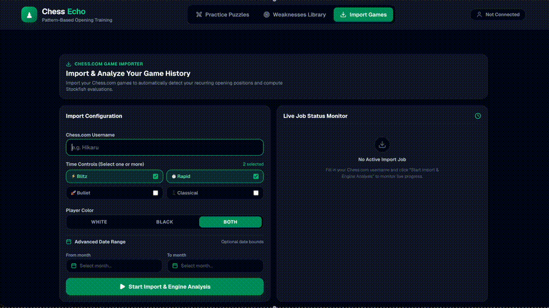
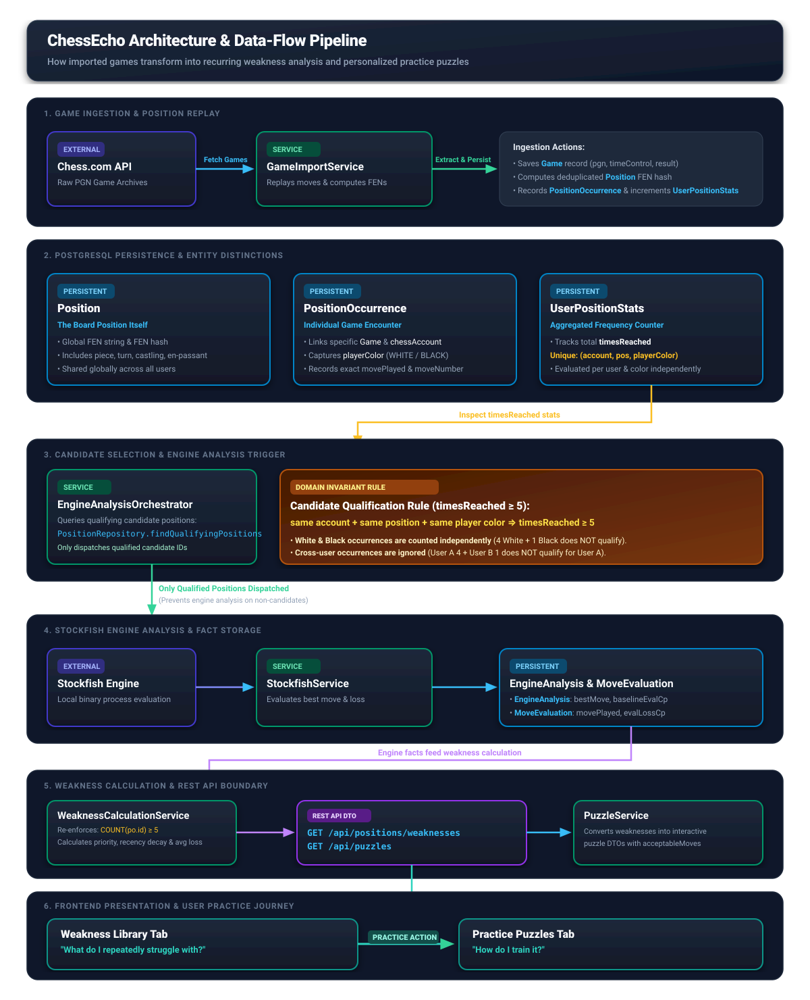

# ChessEcho ♟️

> Find not just what went wrong in a game — but what keeps going wrong across hundreds of them.



Traditional chess analysis tools show you every engine blunder across every game separately. ChessEcho takes a different approach: it finds **recurring board positions** where you repeatedly make sub-optimal decisions, analyzes them with Stockfish, and turns the highest-priority patterns into interactive personalized puzzles.

A single mistake may be accidental. A mistake you repeat across fifty games is a habit worth fixing.

---

## Why ChessEcho?

Most post-game analysis tools answer: *"What went wrong in this game?"*

ChessEcho answers: *"Which positions do I repeatedly reach, and where do I keep making weaker decisions?"*

The difference matters in practice. Suppose you reach a particular opening position 40 times over a year. You play Bf5 in 30 of those games, losing an average of 1.1 pawns each time. A standard analysis engine would show you 30 separate blunders. ChessEcho recognizes the same recurring decision and presents it as one weakness to fix.

The goal is to change habits, not to memorize engine lines.

---

## Features

- **Chess.com game import** via the public API — no credentials required
- **Time-control filtering**: Blitz, Rapid, Bullet, Classical (select one or more)
- **Color filtering**: analyze as White, Black, or Both
- **Recurring position detection**: each imported game is replayed move-by-move; positions are normalized using four FEN fields (piece placement, side to move, castling rights, en passant)
- **Stockfish analysis**: qualifying positions (reached 5+ times) are evaluated at depth 16; each historically played move is individually assessed
- **Recency-weighted weakness ranking**: recent mistakes carry more weight than old ones; positions you consistently struggle with rank higher than one-off blunders
- **Historical game evidence**: each weakness links to the source games where the mistake occurred
- **Interactive personalized puzzles**: practice your actual recurring weaknesses on an interactive board; the system recognizes your historical mistake moves and gives targeted feedback
- **Evaluation bar, hints, undo/redo**: move-by-move evaluation tracking, source-square hint highlighting, and full board navigation
- **Configurable thresholds**: adjust minimum eval loss, minimum mistake count, and color filter without triggering new Stockfish analysis

---

## Tech Stack

| Layer | Technology |
|---|---|
| **Backend** | Kotlin 2.0, Spring Boot 3.3.2 |
| **Database** | PostgreSQL 16, Flyway |
| **Chess engine** | Stockfish (subprocess, depth 16) |
| **Chess library** | kchesslib (PGN parsing, board replay, FEN generation) |
| **Frontend** | Next.js 16, React 19, TypeScript |
| **Board UI** | react-chessboard, chess.js |
| **Styling** | Tailwind CSS 4 |
| **Backend testing** | JUnit 5, Mockito, H2 |
| **Frontend testing** | Vitest, Testing Library |
| **CI** | GitHub Actions |

---

## Getting Started

### Prerequisites

| Tool | Version |
|---|---|
| Java | 21 |
| Node.js | 20 |
| Docker + Docker Compose | any recent version |
| Stockfish | system installation (see below) |

### 1. Clone

```bash
git clone https://github.com/<your-username>/ChessEcho.git
cd ChessEcho
```

### 2. Install Stockfish

Stockfish must be installed separately and available on your system `PATH`.

**macOS:**
```bash
brew install stockfish
```

**Ubuntu / Debian:**
```bash
sudo apt install stockfish
```

Verify the installation:
```bash
stockfish
# Should print "Stockfish ..." and wait for UCI commands. Press Ctrl+C to exit.
```

### 3. Start the Database

```bash
make db-up
```

This starts a PostgreSQL 16 container (`chessecho-postgres`) on port `5432` with:
- Database: `chessecho`
- User: `chessecho`
- Password: `chessecho_pass`

Data is persisted in a named Docker volume (`postgres_data`).

### 4. Start the Backend

**Option A — Docker (recommended)**

```bash
make app-build   # builds the Docker image
make app-up      # starts the application container on port 8080
```

Or start both database and application together:

```bash
make up
```

**Option B — Run locally with Gradle**

```bash
CHESS_PUBAPI_USERNAME=your_chesscom_username \
CHESS_PUBAPI_CONTACT=your_email@example.com \
SPRING_DATASOURCE_URL=jdbc:postgresql://localhost:5432/chessecho \
SPRING_DATASOURCE_USERNAME=chessecho \
SPRING_DATASOURCE_PASSWORD=chessecho_pass \
./gradlew bootRun
```

> **Note:** The [Chess.com PubAPI](https://support.chess.com/en/articles/9650547-what-is-the-pubapi-and-how-do-i-use-it) requires outbound API requests to declare a custom `User-Agent` header (`ChessEcho/1.0 (username: <username>; contact: <email>)`). Before running ChessEcho, set `CHESS_PUBAPI_USERNAME` to your operator Chess.com username (e.g., `your_chesscom_username`) and `CHESS_PUBAPI_CONTACT` to your contact email address.
>
> **Note:** The default `SPRING_DATASOURCE_URL` in `application.yml` points to `postgres:5432` (the Docker Compose hostname). When running the backend outside Docker, you must override the URL to `localhost:5432` as shown above.


The backend starts on **http://localhost:8080**.
Swagger UI is available at **http://localhost:8080/swagger-ui.html**.

### 5. Start the Frontend

```bash
cd frontend
npm ci
npm run dev
```

The frontend starts on **http://localhost:3000**.

By default, the frontend calls `http://localhost:8080/api`. To point it at a different backend, set:
```bash
NEXT_PUBLIC_API_URL=http://your-backend-host/api npm run dev
```

### Stop Everything

```bash
make down
```

---

## How It Works

```
Import Chess.com games
        ↓
Replay each game move-by-move (kchesslib)
        ↓
Identify unique board positions (4-field FEN hash)
        ↓
Count per-user occurrences of each position
        ↓
Positions reached 5+ times → Stockfish analysis candidates
        ↓
Stockfish evaluates position baseline + each historically played move
        ↓
Compare historical moves against engine evaluation → compute eval loss
        ↓
Aggregate by user: mistakeCount, averageLoss, recency-weighted priority
        ↓
Rank recurring weaknesses and serve as personalized puzzles
```

### Why Recurring Positions?

Rather than collecting every individual engine blunder, ChessEcho focuses on positions you reach repeatedly. A single bad move in a game you will never see again is not worth drilling. A bad habit you repeat across 20 games is worth treating.

Filtering by recurrence means ChessEcho surfaces decisions you will likely encounter again — and gives you the opportunity to change the outcome.

### How Position Identity Is Defined

Two positions are considered identical only when all four of the following match:

- **Piece placement** — where every piece is on the board
- **Side to move** — whose turn it is
- **Castling rights** — which castling options remain available
- **En passant availability** — whether an en passant capture is currently legal

Move-order transpositions that produce legally identical positions are grouped together. Positions with the same piece placement but different castling rights are treated as distinct.

---

## Architecture



### Components

**Next.js frontend** — a single-page application with three tabs: Import Games, Weaknesses Library, and Practice Puzzles. Tab state and username are persisted via `localStorage` and the URL hash.

**Kotlin/Spring Boot backend** — handles game import (via Chess.com's public API), PGN parsing, position detection, engine analysis orchestration, weakness calculation, and puzzle serving. Runs on port 8080.

**PostgreSQL** — stores users, chess accounts, imported games, board positions, position occurrences, engine analysis results, and import job state. Schema is managed by Flyway with a single migration.

**Asynchronous import job** — when a game import is started, the backend creates a job record and executes the full pipeline asynchronously. Stockfish analysis runs inside the same job. The frontend polls for job status every two seconds.

**Stockfish analysis** — qualifying positions are analyzed by spawning Stockfish as a subprocess. The baseline position evaluation and the evaluation of each historically played move are stored. Analysis runs at depth 16.

**Global engine-analysis reuse** — engine analysis is stored at the position level, not the user level. If two different users have both reached the same position, Stockfish only runs once and results are shared.

**On-demand weakness calculation** — weakness ranking is computed per request by joining position occurrences, engine analysis, and per-move evaluations. There is no precomputed materialized view.

### Domain Model

```
ChessAccount
    │
    │ (via Game)
    ▼
PositionOccurrence ──── Position ──── EngineAnalysis
                                           │
                                      MoveEvaluation

UserPositionStats   (aggregated reach counts per account/position/color)
```

---

## How Weakness Detection Works

1. **Every imported game is replayed move-by-move.** For each move the target player makes, a record is created linking the player's account, the board position, the move played, and the source game.

2. **Positions are normalized to a 4-field FEN hash** (SHA-256 of piece placement + side to move + castling rights + en passant). Transpositions producing legally identical states are grouped.

3. **Occurrence counts are tracked per account and per color separately.** A position reached 4 times as White and 4 times as Black produces 4 White occurrences and 4 Black occurrences — not 8 combined.

4. **Positions reaching the occurrence threshold become Stockfish analysis candidates.** The default threshold is 5. Stockfish evaluates the baseline position and every historical move played from it.

5. **Eval loss is computed per move.** For each historical move, the difference between the engine's best-move evaluation and the evaluation of the move actually played is stored in pawns.

6. **Weaknesses are aggregated and ranked.** A weakness surfaces when, for a given account and position, the number of qualifying mistakes meets `minMistakeCount`. Priority is weighted by recency:

   ```
   weight   = max(0.1, 1.0 − (daysSinceGame / 365))
   priority = sum(evalLoss × weight) × (mistakeCount / timesReached)
   ```

   A mistake made this week weighs more than one made a year ago. Positions you consistently struggle with rank higher than positions where you had one bad day.

### Important Limitation: Exact Position Matching

ChessEcho currently works with **exact recurring positions**. It identifies games where the identical board state was reached, not games that share a broader strategic theme.

It does not currently recognize abstract patterns such as:
- *"You frequently push pawns in front of your castled king"*
- *"You tend to exchange your fianchettoed bishop too early"*

These are future research directions. The current system identifies concrete, frequently occurring board states where the player's historical move choices are demonstrably weaker than the engine's recommendation.

---

## Current Status

ChessEcho is a **functional MVP**. The core pipeline works end-to-end:

**Import → Engine Analysis → Weakness Detection → Personalized Puzzle Practice**

---

An important finding from testing the system:

> **Engine evaluation loss does not always correspond to a genuine player weakness.** Intentional opening experiments, unusual repertoire choices, or positions where the engine's preferred move is objectively correct but rarely played at the human level can all surface as apparent weaknesses. The weakness ranking reflects objective evaluation loss, not a judgment about whether a move was actually a mistake in context.

This is a known open problem in the design — not a bug — and is an active area of improvement. The configurable `minEvalLoss` and `minMistakeCount` thresholds provide partial control but cannot fully eliminate false positives.

---

## Known Limitations

- **No authentication.** Any Chess.com username can be imported. This is appropriate for local and demo use, not for a public multi-user deployment.
- **Chess.com only.** Lichess is not currently implemented.
- **Engine analysis can take several minutes for large histories.** A player with thousands of games may have many qualifying positions, each requiring individual analysis.
- **Stockfish runs sequentially as a subprocess.** A new process is spawned per position analysis. There is no persistent engine connection or analysis pool. This is the primary performance bottleneck for large imports.
- **Exact position matching only.** Weaknesses are identified from identical recurring board states, not from generalized chess concepts or strategic patterns.
- **Intentional or unusual opening choices can produce false positives.** Evaluation loss does not always mean a recurring mistake by human standards.
- **No opening name classification.** Weakness positions are not currently labeled with ECO codes or opening names.
- **No explicit progress-tracking UI.** As new games are imported, weakness scores update automatically. There is no dedicated dashboard showing how a weakness has evolved over time.

---

## Running Tests

### Backend

```bash
./gradlew test          # run all tests
./gradlew ktlintCheck   # lint
./gradlew ktlintFormat  # auto-format
```

Backend tests use H2 in-memory and require neither PostgreSQL nor Stockfish. The suite includes:
- Unit tests for position parsing, weakness calculation, engine analysis orchestration, and priority ranking
- Integration tests covering the full game import pipeline with a mocked Chess.com HTTP client

### Frontend

```bash
cd frontend
npm run test           # vitest run
npx tsc --noEmit       # type-check
npm run lint           # eslint
npm run build          # production build
```

---

## API Overview

Full API details are documented in [`API_CONTRACT.md`](./API_CONTRACT.md). A Swagger UI is available at **http://localhost:8080/swagger-ui.html** when the backend is running.

**Start a game import**
```http
POST /api/games/import
```
```json
{
  "username": "YourChessComUsername",
  "platform": "CHESS_COM",
  "timeControls": ["BLITZ", "RAPID"],
  "playerColor": "BOTH",
  "fromDate": "2024-01",
  "toDate": "2025-12"
}
```
Returns `202 Accepted` with a `jobId`. Returns `409 Conflict` if an import is already in progress for this account.

**Poll import job status**
```http
GET /api/jobs/{jobId}
```
Returns `QUEUED`, `PROCESSING`, `COMPLETED`, or `FAILED` with counts of games imported and games skipped (already imported).


**Get recurring weaknesses**
```http
GET /api/positions/weaknesses?platform=CHESS_COM&username=YourUsername&playerColor=BOTH&minEvalLoss=0.8&minMistakeCount=3&page=0&size=20
```

| Parameter | Default | Description |
|---|---|---|
| `platform` | required | `CHESS_COM` |
| `username` | required | Chess.com username |
| `playerColor` | required | `WHITE`, `BLACK`, or `BOTH` |
| `minEvalLoss` | `0.8` | Minimum pawn loss to count a move as a mistake |
| `minMistakeCount` | `3` | Minimum qualifying mistakes; can be set as low as 1 |
| `page` / `size` | `0` / `20` | Pagination |

**Get personalized puzzles**
```http
GET /api/puzzles?platform=CHESS_COM&username=YourUsername&playerColor=BOTH&minEvalLoss=0.8&minMistakeCount=3&limit=10&page=0
```

**Get imported games**
```http
GET /api/games?platform=CHESS_COM&username=YourUsername&page=0&size=20
```

---

## Design Principles

**Analyze patterns, not individual games.** A single mistake is noise. A mistake repeated across dozens of games reveals a habit.

**Separate chess knowledge from player behavior.** Stockfish evaluation is objective and shared globally. Player weaknesses are personal and computed per account.

**Store facts, compute insights.** The system stores raw positions, moves, and engine evaluations. Derived statistics — priority, weakness ranking, acceptable alternatives — are computed from those facts on request.

**Improve decisions, not engine imitation.** The goal is not to memorize engine moves. The goal is to recognize recurring situations and make stronger decisions from them.
