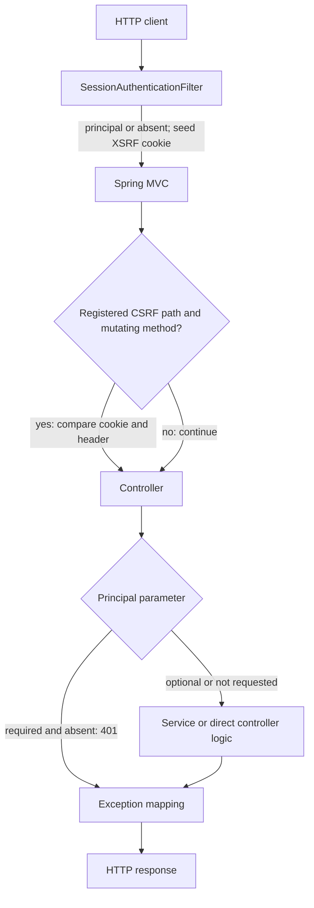
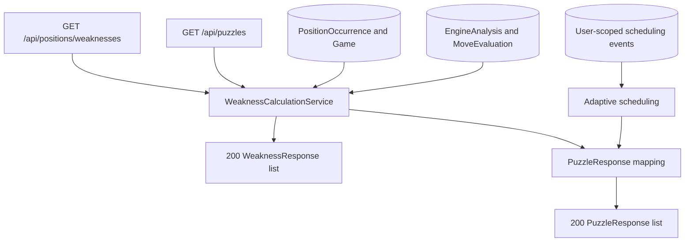
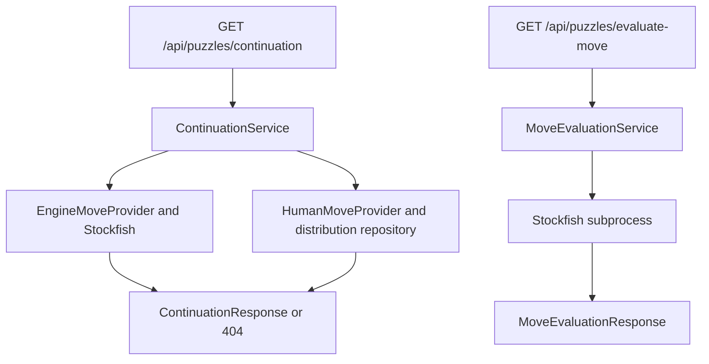
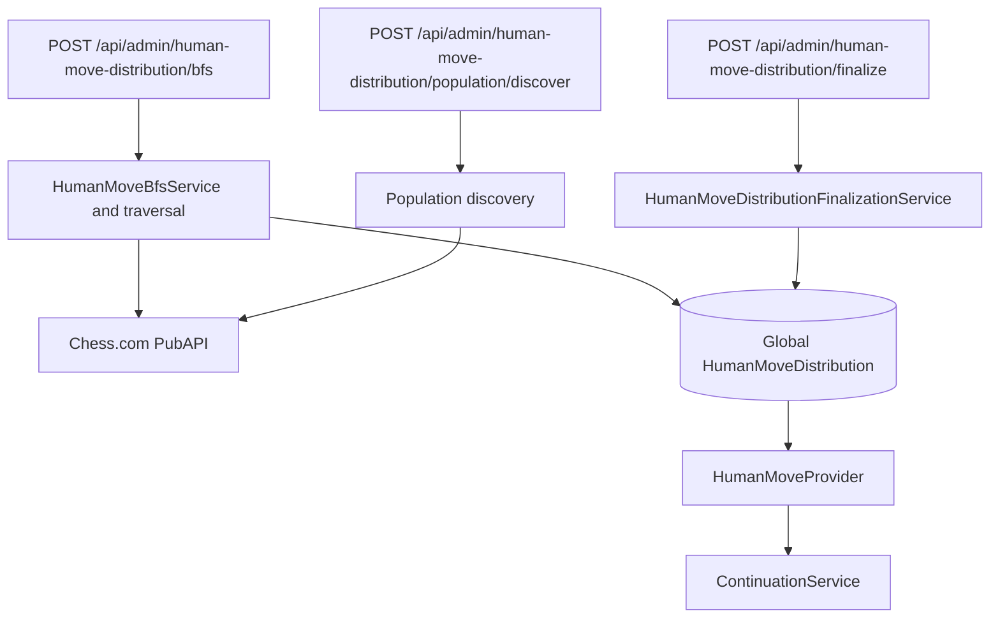

# Backend architecture

This guide is the implementation-oriented entry point for ChessEcho's backend.
It covers the controller-backed HTTP surface and the boundaries behind it; the
frontend-to-API/UI path is tracked separately by [#424](https://github.com/NathanZK/ChessEcho/issues/424).
The [API contract](../../API_CONTRACT.md) describes external behavior, while
the linked subsystem documents below retain deeper domain detail.

## Boundaries

| Boundary | Responsibility and data |
|---|---|
| HTTP | Spring MVC controllers bind query/path/body/multipart inputs to domain values or request DTOs. Responses are DTOs, pages, empty status responses, or (for artifact download) a streamed resource. |
| Request identity | `SessionAuthenticationFilter` resolves an opaque session cookie into an optional request principal and seeds the readable CSRF cookie. The principal argument resolver rejects only handlers that require a principal. The CSRF interceptor is registered for a finite set of paths. |
| Application behavior | Services coordinate identity/session lifecycle, account association and ownership, imports, analysis, recommendation, training, progress, and human-move corpus operations. Some controllers intentionally call repositories directly; those cases are shown below. |
| Persistence | Spring Data repositories persist users, identities, sessions, accounts, jobs, games, positions, occurrences, engine evaluations, training attempts/events, and human-move/corpus records in PostgreSQL. Flyway applies the pre-deployment baseline at `src/main/resources/db/migration/V1__baseline.sql`; database constraints and triggers enforce invariants in addition to service checks. |
| External/process | `ChessComClient` calls the Chess.com PubAPI. `StockfishService` manages the Stockfish subprocess for analysis and move evaluation. Corpus artifacts cross a filesystem boundary under the configured archive root. |

The endpoint diagrams and tables below cover 33 method mappings across the 16
current controllers, including routes behind profile/property conditions.

## Request identity, account scope, and errors



`SessionAuthenticationFilter` never rejects a request; an invalid, expired, or
absent session simply yields no principal. A required `AuthenticatedPrincipal`
is then rejected by `AuthenticatedPrincipalArgumentResolver` with 401. Optional
principal parameters opt into guest-capable routes. The session filter does not
by itself authorize access to an account or job.

The CSRF interceptor checks non-safe methods only when the path matches one of
these registrations: `/api/logout`, `/api/dev/session`, `/api/accounts`,
`/api/accounts/*/connection`, `/api/games/import`, `/api/register`, and
`/api/login`. For those handlers it compares `X-XSRF-TOKEN` with the
`XSRF-TOKEN` cookie in constant time. GET, HEAD, OPTIONS, and CORS preflight are
exempt. Other POST/DELETE routes do not acquire CSRF protection merely by using
the same controller package.

`AccountOwnershipService` is the application boundary for account-backed
access. Guest username-based reads/imports resolve only unclaimed accounts;
authenticated import/association operations verify current ownership.
Authenticated shared-data reads using an account UUID require a principal and
an existing account, but are not uniformly owner-only. Private training history
is separately scoped by application user. A username, account UUID, or job UUID
is not an authentication credential.

The `/api/admin` prefix is not an authorization policy. The human-move corpus
controllers below have no principal parameter or invoked account guard, and
their paths are not in the CSRF registration lists. Do not infer administrative
authorization from the URL prefix.

`GlobalExceptionHandler` maps authentication and CSRF failures to 401
`UNAUTHENTICATED` and 403 `CSRF_FAILED`; account absence/denial to 404/403;
request validation to 400 `VALIDATION_ERROR`; and resource absence to 404
`NOT_FOUND`, using structured `ErrorResponse` bodies. It also maps duplicate
registration and active-import conflicts to 409. Corpus-run integrity errors
have a controller-local 409 mapping. Artifact, import, projection, and
cross-cohort routes use an advice for invalid input (400), artifact conflicts
(409), and persistence failures (500). Endpoint tables call out additional
route-specific responses.

See [identity and session](identity-and-session.md),
[account data boundary](../specs/account-data-boundary.md), and
[connected account state](../specs/connected-account-state.md) for lifecycle
and ownership invariants.

## Identity and connected accounts

```mermaid
flowchart TB
    Register[POST /api/register] --> Local[LocalCredentialService and session persistence]
    Login[POST /api/login] --> Local
    Me[GET /api/me] --> Principal[Required principal resolver]
    Principal --> MeResponse[CurrentUserResponse]
    Logout[POST /api/logout] --> Revoke[IdentitySessionService revokes optional cookie]
    Revoke --> Clear[Clear session cookie]
    Dev[POST /api/dev/session] --> DevIdentity[Conditional DevIdentityProvider]
    DevIdentity --> Session[IdentitySessionService and session cookie]
    List[GET /api/accounts] --> Accounts[AccountOwnershipService]
    Associate[POST /api/accounts] --> Accounts
    Disconnect[DELETE /api/accounts/{accountId}/connection] --> Accounts
    Accounts --> AccountRows[(ChessAccountRepository)]
```

The dev-session route exists only under the `{dev, local}` profile allowlist
and when `chessecho.auth.dev-mode.enabled=true`; otherwise its controller is
absent. The table records the response and access boundary for each route.

| Method and path | Controller inputs and execution/data path | Response | Access boundary |
|---|---|---|---|
| `POST /api/register` | `AuthController`; `RegistrationRequest` JSON → `LocalCredentialService` → identity/session persistence; writes the session cookie. | 201 `AuthResponse`. | CSRF; no pre-existing session required. Duplicate canonical email maps to 409. |
| `POST /api/login` | `AuthController`; `LoginRequest` JSON → `LocalCredentialService` → identity/session persistence; writes the session cookie. | 200 `AuthResponse`. | CSRF; no pre-existing session required. Unknown email and wrong password share 401 `INVALID_CREDENTIALS`. |
| `GET /api/me` | `SessionController`; required `AuthenticatedPrincipal` → `CurrentUserResponse`. | 200 `CurrentUserResponse`. | Required session; absent/expired session is 401. |
| `POST /api/logout` | `SessionController`; optional configured session-cookie value → `IdentitySessionService.revokeSession` when present → cookie clear. | 204, idempotent. | CSRF; no principal required. |
| `POST /api/dev/session` | `DevSessionController`; servlet request → `DevIdentityProvider.claims` → `IdentitySessionService.establishSession` → session cookie and `CurrentUserResponse`. | 200 `CurrentUserResponse`. | CSRF; conditional profile/property route, otherwise 404. |
| `GET /api/accounts` | `AccountController`; required principal → `AccountOwnershipService.listOwnedAccounts` → `ChessAccountRepository`. | 200 list of `ChessAccountResponse`. | Required session; returns accounts owned by that user. |
| `POST /api/accounts` | `AccountController`; principal and `AccountAssociationRequest` JSON → `AccountOwnershipService` → locked/transactional `ChessAccountRepository` insert or claim. | 201 when created; 200 when already associated. | Required session and CSRF. Concurrent claim conflicts map to 409. |
| `DELETE /api/accounts/{accountId}/connection` | `AccountController`; UUID path value and principal → `AccountOwnershipService.disconnect` → locked account row; clears the mutable owner link. | 204. | Required session and CSRF. |

## Imports and game reads

```mermaid
flowchart TB
    Start[POST /api/games/import] --> Own[Resolve guest or owned account]
    Own --> Job[(Persist immutable AsyncJob)]
    Job --> Accepted[202 ImportJobResponse]
    Job --> Worker[@Async worker claims job and reloads snapshot]
    Worker --> PubAPI[Chess.com archives and monthly games]
    PubAPI --> Parse[Parse PGN and replay positions]
    Parse --> UserData[(Game, Position, PositionOccurrence)]
    UserData --> Qualify[Qualify affected positions]
    Qualify --> Stockfish[Stockfish subprocess]
    Stockfish --> EngineData[(EngineAnalysis and MoveEvaluation)]
    Worker --> Poll[GET /api/jobs/{id}]
    Poll --> Status[JobStatusResponse]
    Games[GET /api/games] --> GameService[GameService and account resolution]
    GameService --> GameRows[(ChessAccount and GameRepository)]
    GameRows --> GamePage[Page of GameDto]
```

The import controller creates a job and submits its ID to
`GameImportService.executeImportJob`; the worker is asynchronous. The worker
reconstructs its command from the persisted immutable account/date/time-control/
color snapshot, not a later request. Transactions wrap database work rather
than outbound Chess.com calls. The job tracks import and analysis status
separately, uses worker tokens and leases, records progress, and can fail on
invalid persisted configuration or failed work. A database constraint prevents
overlapping active imports for one account.

Analysis is global per position. The orchestrator selects qualifying affected
positions; `EngineAnalysisService` evaluates missing candidates without holding
a database transaction around Stockfish. Unique position/move constraints
provide conflict-safe recovery.

`GameParserService` replays PGN into account/game/color-scoped occurrences. Its
position key hashes the first four FEN fields; `EngineAnalysis` and its move
evaluations are shared by position, while weakness ranking is recalculated for
the selected account. The active import threshold is five occurrences by
default.

| Method and path | Controller inputs and execution/data path | Response | Access boundary |
|---|---|---|---|
| `POST /api/games/import` | `GameImportController`; optional principal and validated `ImportGamesRequest` JSON → `GameImportService.createImportJob` → account resolution and persisted immutable `AsyncJob`; submits job ID to `@Async executeImportJob`. | 202 `ImportJobResponse`. | Optional session and CSRF. Guests can import only unclaimed usernames; authenticated requests select an owned account UUID. |
| `GET /api/jobs/{id}` | `GameImportController`; UUID and optional principal → direct `AsyncJobRepository` load plus optional `ArchiveDerivedProcessingRepository` status lookup → `AccountOwnershipService.authorizeJob` → `JobStatusResponse`. | 200 `JobStatusResponse`. | Optional session; guests can poll only while the account is unclaimed, authenticated callers only when they initiated the job. Missing or unresolved jobs map to 404. |
| `GET /api/games` | `GameController`; optional query inputs `username`, `platform` (default `CHESS_COM`), `accountId`, Spring `Pageable`; optional principal → `GameService` → `AccountOwnershipService` and `GameRepository` → `Page<GameDto>`. | 200 page of `GameDto`. | Optional session. Authenticated reads select an account UUID; username-based guest reads resolve only unclaimed accounts. |

## Weaknesses and puzzles



Weaknesses and puzzles are read-time interpretations of occurrences and engine
evaluations. `WeaknessCalculationService` combines objective move loss with
optional account-scoped practical outcome evidence, then returns stable
ordering to both consumers. These read routes do not invoke Stockfish or persist
a weakness materialization; the reserved `UserPositionWeakness` model is not
the active read path. See [precomputed weakness analysis](precomputed-weakness-analysis.md)
and [practical weakness prioritization](practical-weakness-prioritization.md).

| Method and path | Controller inputs and execution/data path | Response | Access boundary |
|---|---|---|---|
| `GET /api/positions/weaknesses` | `WeaknessController`; optional `platform`, `username`, `accountId`, `minEvalLoss` (default 0.8), `minMistakeCount` (default 3), `page` (default 0), `size` (default 20); required `playerColor`; optional principal → `WeaknessCalculationService` → occurrence/game, engine/move-evaluation, practical-evidence, and account-scoped scheduling reads → page slice. | 200 list of `WeaknessResponse`. | Optional session; account selection follows guest/private versus authenticated shared-read rules. GET is CSRF-exempt. |
| `GET /api/puzzles` | `PuzzleController`; optional `platform`, `username`, `accountId`, `minEvalLoss` (default 0.8), `minMistakeCount` (default 3), `limit` (default 5), `page` (default 0); required `playerColor`; optional principal → same weakness read path → `PuzzleResponse` mapping. | 200 list of `PuzzleResponse`. | Optional session; account selection follows the weakness route rules. GET is CSRF-exempt. |

## Continuation and move evaluation



`ContinuationService` selects the requested provider. A HUMAN request with no
eligible empirical moves falls back to ENGINE; an ENGINE request uses Stockfish
directly. Move evaluation validates FEN and move legality before calling
Stockfish.

| Method and path | Controller inputs and execution/data path | Response | Access boundary |
|---|---|---|---|
| `GET /api/puzzles/continuation` | `PuzzleController`; required `fen`; optional `mode` (default `ENGINE`) and `ratingBand` → `ContinuationService` → engine/Stockfish or human distribution provider. | 200 `ContinuationResponse`, or 404 when no candidates exist. | No principal; GET is CSRF-exempt. |
| `GET /api/puzzles/evaluate-move` | `PuzzleController`; required `fen` and `move` → `MoveEvaluationService` validates position/move and calls Stockfish. | 200 `MoveEvaluationResponse`; invalid FEN/move maps to 400. | No principal; GET is CSRF-exempt. |

See [human-move provider architecture](human-move-provider.md) for the
empirical provider, rating bands, and fallback behavior.

## Training and progress

```mermaid
flowchart TB
    AttemptRoute[POST /api/puzzles/attempt] --> AttemptService[TrainingAttemptService]
    AttemptService --> AttemptRepo[(TrainingAttemptRepository)]
    AttemptRepo --> AttemptResponse[TrainingAttemptResponse]
    EventRoute[POST /api/puzzles/events] --> EventController[PuzzleEventController direct path]
    EventController --> EventRepos[(AccountOwnership, occurrence, user, event repositories)]
    EventRepos --> EventResponse[202 accepted or 404]
    ProgressRoute[GET /api/positions/{positionId}/progress] --> Progress[ProgressService]
    Progress --> ProgressRepos[(Owned accounts, occurrences, SOLVED events, engine analysis)]
    ProgressRepos --> ProgressResponse[ProgressResponse]
```

A training attempt is saved through `TrainingAttemptService`; a scheduling
event is written directly by `PuzzleEventController` after resolving the
account and matching occurrence. `ProgressService` computes baseline and
intervals in memory from the authenticated user's owned-account occurrences,
their `Game.playedAt` values, SOLVED events, and engine evaluations. It does
not persist derived progress.

| Method and path | Controller inputs and execution/data path | Response | Access boundary |
|---|---|---|---|
| `POST /api/puzzles/attempt` | `TrainingAttemptRequest` JSON and optional principal → `TrainingAttemptService` validates timing/outcome, optionally resolves `accountId`, then saves `TrainingAttemptRepository` and optional user reference. | 200 `TrainingAttemptResponse`. | Optional session; authenticated attempts must select an account, and account UUIDs require a session. No CSRF registration. |
| `POST /api/puzzles/events` | `PuzzleEventRequest` JSON and required principal → direct `AccountOwnershipService.resolveSharedAccount`, `PositionOccurrenceRepository` lookup, `AppUserRepository` reference, then `PuzzleSchedulingEventRepository.save`. | 202 empty body; 404 if no matching occurrence. | Required session. No CSRF registration. |
| `GET /api/positions/{positionId}/progress` | `ProgressController`; UUID path value, required `playerColor`, required principal → `ProgressService` reads owned accounts, occurrences, user's SOLVED events, and engine evaluation; computes baseline/intervals in memory. | 200 `ProgressResponse`. | Required session; absent/expired session is 401. No derived progress row is written. |

See [position progress](../specs/position-progress.md) for interval boundaries,
late-import handling, and evidence rules.

## Human-move distribution and corpus operations



```mermaid
flowchart TB
    Create[POST /api/admin/human-move-distribution/corpus-runs] --> RunService[HumanMoveCorpusService]
    RunService --> RunTraversal[Shared traversal and qualification]
    RunTraversal --> RunRows[(Run, games, observations)]
    List[GET /api/admin/human-move-distribution/corpus-runs] --> RunReads[HumanMoveCorpusService reads]
    Detail[GET /api/admin/human-move-distribution/corpus-runs/{runId}] --> RunReads
    RunReads --> RunRows
    Checkpoint[POST /api/admin/human-move-distribution/corpus-runs/{runId}/checkpoints] --> CheckpointService[Read-only checkpoint calculation]
    CheckpointService --> RunRows
```

```mermaid
flowchart TB
    Materialize[POST /api/admin/human-move-distribution/corpus-projections/materialize] --> Materializer[HumanMoveCorpusMaterializationService]
    Finalize[POST /api/admin/human-move-distribution/corpus-projections/{projectionId}/finalize] --> ProjectionFinalizer[Projection finalization service]
    Compare[POST /api/admin/human-move-distribution/corpus-projections/compare] --> Comparator[HumanMoveCorpusCrossCohortService]
    Materializer --> ProjectionData[(Corpus and projection repositories)]
    ProjectionFinalizer --> ProjectionData
    Comparator --> ProjectionData
```

```mermaid
flowchart TB
    Export[POST /api/admin/human-move-distribution/corpus-artifacts/export] --> ArtifactService[HumanMoveCorpusArtifactService]
    Download[GET /api/admin/human-move-distribution/corpus-artifacts/{contentDigest}] --> ArtifactService
    Verify[POST /api/admin/human-move-distribution/corpus-artifacts/verify] --> ArtifactService
    Import[POST /api/admin/human-move-distribution/corpus-artifacts/import] --> ImportService[HumanMoveCorpusImportService]
    Purge[POST /api/admin/human-move-distribution/corpus-artifacts/{runId}/purge] --> PurgeService[HumanMoveCorpusPurgeService]
    ArtifactService --> Files[(Configured archive filesystem)]
    ImportService --> Corpus[(Corpus repositories)]
    PurgeService --> Corpus
    PurgeService --> Files
    Files --> Download
```

The `/bfs` collector accumulates global distribution observations and
`/finalize` applies its retention decision. Corpus runs have isolated run-scoped
game/observation state and read-only nested checkpoints. Artifact
export/import/verification and projections form separate file/database
lifecycles. Their integrity, atomicity, recovery, and portability details are
maintained in [human-move provider architecture](human-move-provider.md) and
[human-move corpus portability](../engineering/human-move-corpus-portability.md).

All routes in these diagrams are deliberately unauthenticated at the
application-controller level: they do not request a principal or invoke an
account guard, and no route matches the registered CSRF paths. `/api/admin` is
only a URL prefix, not an access control.

| Method and path | Controller inputs and execution/data path | Response | Access boundary |
|---|---|---|---|
| `POST /api/admin/human-move-distribution/bfs` | `HumanMoveBfsController`; `HumanMoveBfsRequest` JSON → `HumanMoveBfsService.runBfs` → Chess.com traversal and global distribution persistence. | 200 `HumanMoveBfsResponse`. | No principal; no CSRF registration. |
| `POST /api/admin/human-move-distribution/population/discover` | `HumanMoveBfsController`; `HumanMovePopulationDiscoveryRequest` JSON → `HumanMoveBfsService.discoverPopulation` → population discovery/provider logic. | 200 `HumanMovePopulationDiscoveryResponse`. | No principal; no CSRF registration. |
| `POST /api/admin/human-move-distribution/finalize` | `HumanMoveBfsController`; `HumanMoveFinalizeRequest` JSON → `HumanMoveDistributionFinalizationService` → transactional band-scoped distribution deletion. | 200 `HumanMoveFinalizeResponse`. | No principal; no CSRF registration. |
| `POST /api/admin/human-move-distribution/corpus-runs` | `HumanMoveCorpusController`; `HumanMoveCorpusRunRequest` JSON → `HumanMoveCorpusService.runCorpus` → traversal, external game fetch, and run/game/observation persistence. | 200 `HumanMoveCorpusRunResponse`. | No principal; no CSRF registration. |
| `GET /api/admin/human-move-distribution/corpus-runs` | `HumanMoveCorpusController`; no inputs → `HumanMoveCorpusService.listRuns` → corpus-run repository. | 200 list of `HumanMoveCorpusRunResponse`. | No principal; no CSRF registration. |
| `GET /api/admin/human-move-distribution/corpus-runs/{runId}` | `HumanMoveCorpusController`; UUID path value → `HumanMoveCorpusService.getRun` → corpus-run repository. | 200 `HumanMoveCorpusRunResponse`; missing run maps to 404. | No principal; no CSRF registration. |
| `POST /api/admin/human-move-distribution/corpus-runs/{runId}/checkpoints` | `HumanMoveCorpusController`; UUID and `HumanMoveCorpusCheckpointRequest` JSON → `HumanMoveCorpusCheckpointService.calculate` → integrity checks and read-only prefix aggregation. | 200 `HumanMoveCorpusCheckpointResponse`; integrity failure maps to 409. | No principal; no CSRF registration. |
| `POST /api/admin/human-move-distribution/corpus-projections/materialize` | `HumanMoveCorpusProjectionController`; `HumanMoveCorpusMaterializeRequest` JSON → `HumanMoveCorpusMaterializationService` → corpus/projection persistence. | 200 `HumanMoveCorpusMaterializeResponse`. | No principal; no CSRF registration. |
| `POST /api/admin/human-move-distribution/corpus-projections/{projectionId}/finalize` | `HumanMoveCorpusProjectionController`; UUID path value → `HumanMoveCorpusProjectionFinalizationService` → projection repository and transactional finalization. | 200 `HumanMoveCorpusProjectionFinalizeResponse`. | No principal; no CSRF registration. |
| `POST /api/admin/human-move-distribution/corpus-projections/compare` | `HumanMoveCorpusCrossCohortController`; `HumanMoveCorpusCrossCohortCompareRequest` JSON → `HumanMoveCorpusCrossCohortService` → read-only cross-cohort projection comparison. | 200 `HumanMoveCorpusCrossCohortCompareResponse`. | No principal; no CSRF registration. |
| `POST /api/admin/human-move-distribution/corpus-artifacts/export` | `HumanMoveCorpusArtifactController`; `HumanMoveCorpusExportRequest` JSON → `HumanMoveCorpusArtifactService.export` → archive filesystem and export receipt. | 200 `HumanMoveCorpusExportReceipt`. | No principal; no CSRF registration. |
| `GET /api/admin/human-move-distribution/corpus-artifacts/{contentDigest}` | `HumanMoveCorpusArtifactController`; digest path value → `HumanMoveCorpusArtifactService.verifiedArchivePath` → filesystem read as `application/octet-stream` resource. | 200 streamed `Resource`; missing artifact maps to 404. | No principal; no CSRF registration. |
| `POST /api/admin/human-move-distribution/corpus-artifacts/verify` | `HumanMoveCorpusArtifactController`; multipart `artifact` plus `expectedDigest` query parameter → controller size check → `HumanMoveCorpusArtifactService.verify`; no publication/write path. | 200 empty body. Invalid/oversized artifact maps to 400. | No principal; no CSRF registration. |
| `POST /api/admin/human-move-distribution/corpus-artifacts/import` | `HumanMoveCorpusImportController`; multipart `artifact` plus `expectedDigest` query parameter → `HumanMoveCorpusImportService.import` → verified artifact processing and transactional corpus publication. | 200 `HumanMoveCorpusImportReceipt`. | No principal; no CSRF registration. |
| `POST /api/admin/human-move-distribution/corpus-artifacts/{runId}/purge` | `HumanMoveCorpusImportController`; UUID and `HumanMoveCorpusPurgeRequest` JSON (`contentDigest`) → `HumanMoveCorpusPurgeService.purge` → corpus persistence and archive lifecycle. | 200 `HumanMoveCorpusPurgeResult`. | No principal; no CSRF registration. |

## Configuration and operational dependencies

| Concern | Current source/configuration |
|---|---|
| Database/schema | `SPRING_DATASOURCE_URL`, `SPRING_DATASOURCE_USERNAME`, and `SPRING_DATASOURCE_PASSWORD`; Hibernate validates the schema and Flyway loads `V1__baseline.sql`. |
| Chess.com PubAPI | `CHESS_PUBAPI_USERNAME` and `CHESS_PUBAPI_CONTACT` are required to build the User-Agent. `CHESS_PUBAPI_DELAY_MS`, `CHESS_PUBAPI_MAX_RETRIES`, `CHESS_PUBAPI_INITIAL_BACKOFF_MS`, and `CHESS_PUBAPI_MAX_BACKOFF_MS` control pacing/retries. Requests are globally serialized; 429 and selected transient 5xx responses are retried. |
| Stockfish | `STOCKFISH_PATH` selects the executable. Import analysis uses depth 16 and an occurrence threshold of 5 by default; `ENGINE_ANALYSIS_MULTI_PV` sets candidate breadth. Continuation uses `ENGINE_CONTINUATION_MULTI_PV` and `ENGINE_CONTINUATION_MAX_EVAL_LOSS`; move exploration uses `ENGINE_EXPLORATION_MAX_EVAL_LOSS`. |
| Human continuation | `human.continuation.min-observations` defaults to 10 observations before a stored human distribution is served; HUMAN mode falls back to ENGINE when the provider has no eligible moves. |
| Sessions/CSRF | `CHESSECHO_AUTH_COOKIE_SECURE`, `CHESSECHO_AUTH_COOKIE_SAME_SITE`, `CHESSECHO_AUTH_SESSION_IDLE_TIMEOUT`, `CHESSECHO_AUTH_SESSION_ABSOLUTE_TIMEOUT`, and `CHESSECHO_AUTH_DEV_MODE_ENABLED`; defaults are documented in `application.yml`. |
| Practical ranking | `CHESS_WEAKNESS_PRACTICAL_*` settings control enablement, sample floor, comparator/confidence policy, observation window, and policy version. See [practical weakness prioritization](practical-weakness-prioritization.md). |
| Corpus artifacts | `CHESSECHO_CORPUS_ARCHIVE_ROOT`, `CHESSECHO_CORPUS_MAX_ARCHIVE_BYTES`, `CHESSECHO_CORPUS_MAX_EXPANDED_BYTES`, `CHESSECHO_CORPUS_MAX_GAMES`, `CHESSECHO_CORPUS_MAX_OBSERVATIONS`, `CHESSECHO_CORPUS_MAX_RECORD_BYTES`, `CHESSECHO_CORPUS_MULTIPART_MAX_FILE_SIZE`, and `CHESSECHO_CORPUS_MULTIPART_MAX_REQUEST_SIZE` bound the filesystem and upload boundary. |
| CORS | `AppConfig` allows credentialed requests from `http://localhost:3000` and `http://127.0.0.1:3000` with the configured API methods and headers. |

Springdoc's generated Swagger UI/OpenAPI endpoints, including `/swagger-ui.html`
and `/v3/api-docs`, are framework-generated rather than controller mappings and
are outside the endpoint tables. Exact configuration defaults are in
[`application.yml`](../../src/main/resources/application.yml); operator setup
and required PubAPI User-Agent values are in the [README](../../README.md).
The high-level product model and package responsibilities are in
[`docs/tech-spec.md`](../tech-spec.md).
