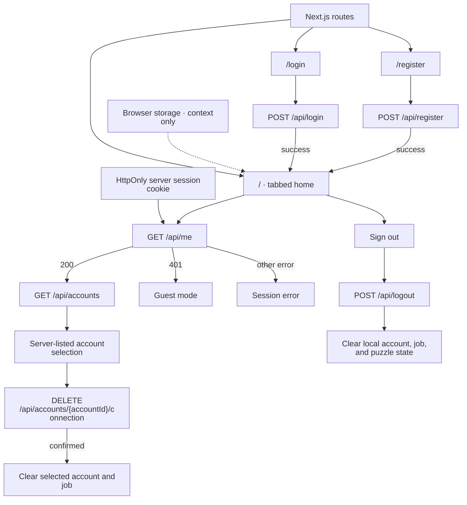
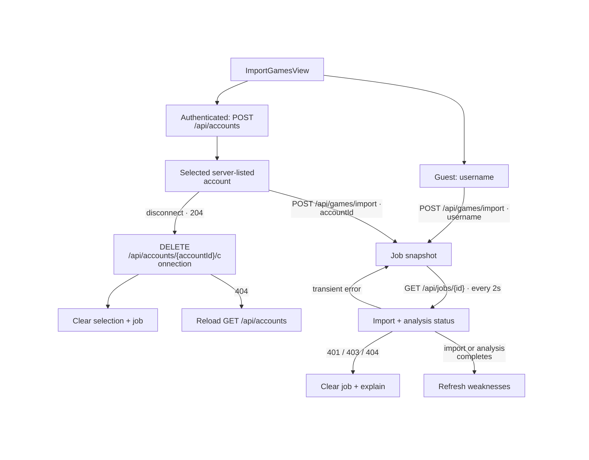
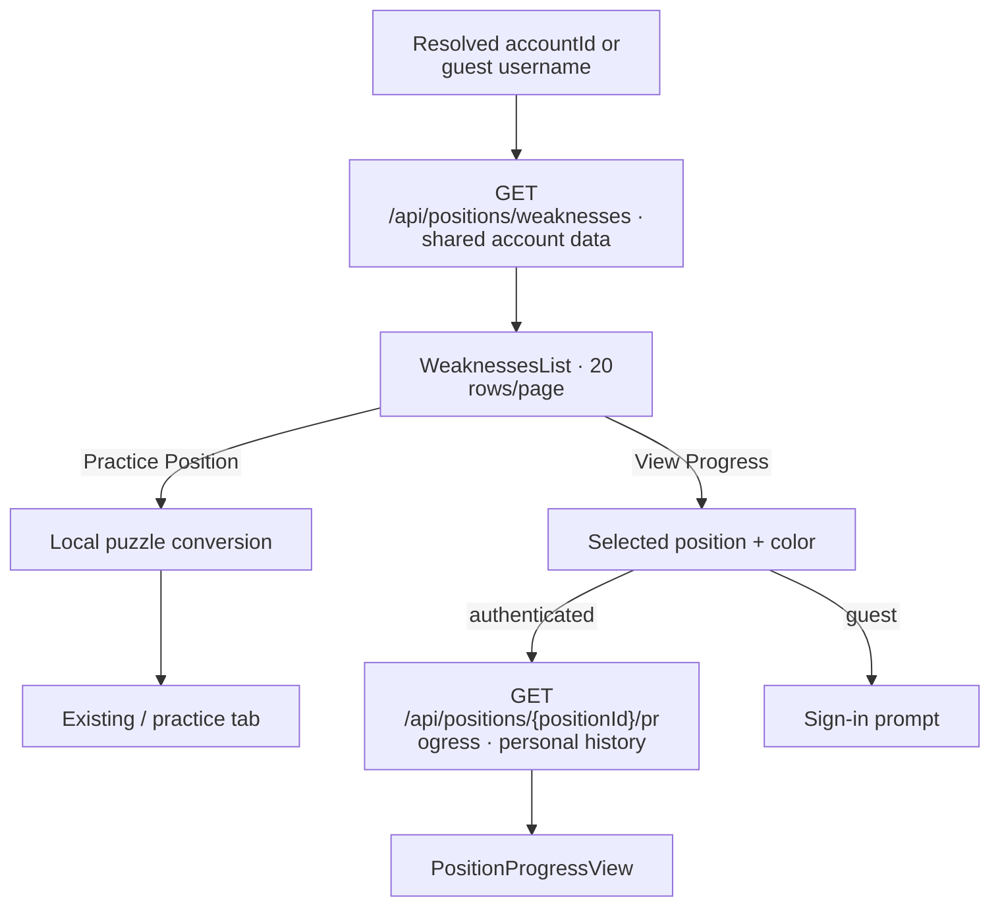
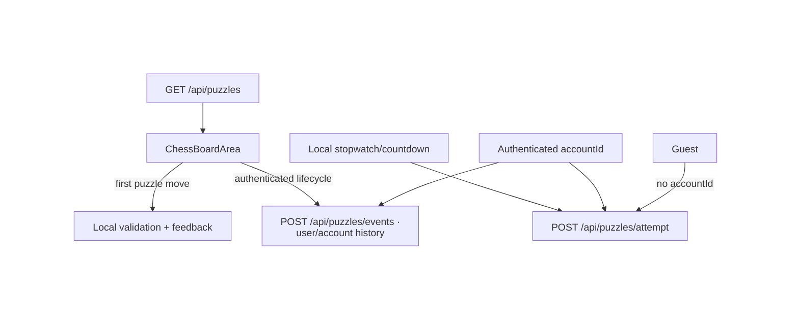
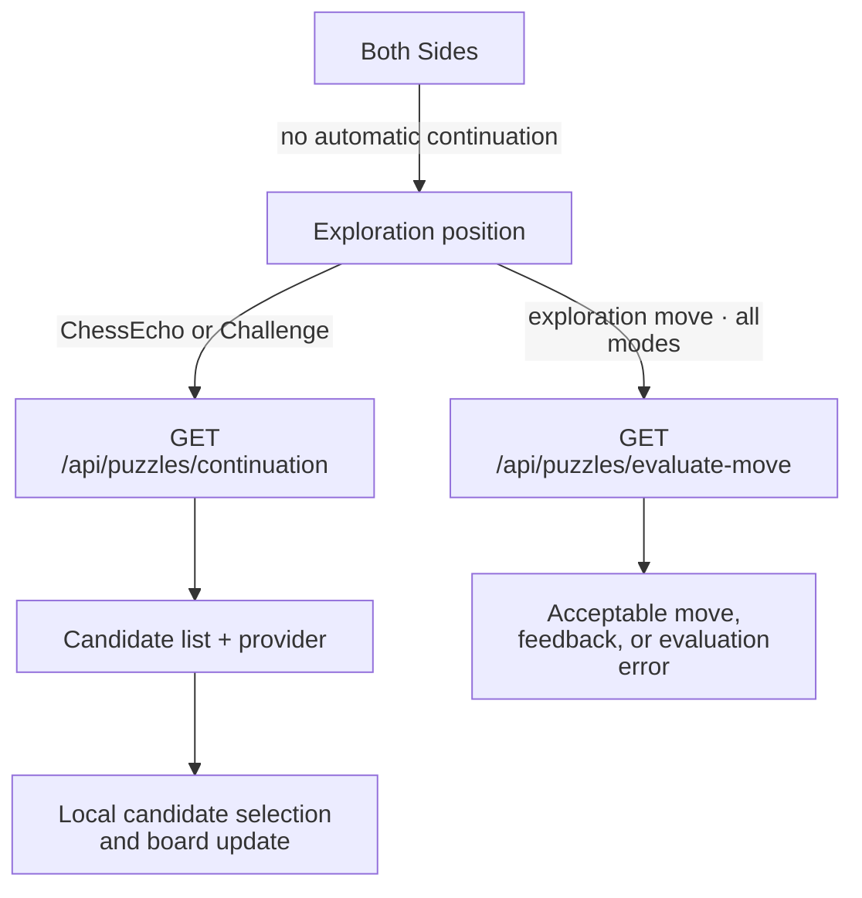

# Frontend architecture

ChessEcho's frontend is a Next.js client application. `/` owns the Import Games,
Weaknesses Library, and Practice Puzzles tabs; `/login` and `/register` are
separate routes. The tabs are views inside the home route, not separate pages.
The [README architecture overview](../../README.md#architecture) links this
guide; backend processing is covered by issue
[#425](https://github.com/NathanZK/ChessEcho/issues/425).

For server-side identity and cookie/CSRF behavior, see
[Identity and Session](identity-and-session.md). For shared imported account
data and user-scoped training history, see
[Chess account data and personal training state](../specs/account-data-boundary.md).
The [API contract](../../API_CONTRACT.md) defines request and response details.

## Route, session, and account boundary

This route map leads to the focused flows below: [import and jobs](#import-games-and-job-monitoring),
[weaknesses and progress](#weaknesses-library-and-position-progress), and
[practice and exploration](#practice-puzzles-and-exploration).

The session cookie supplies identity; local browser stores restore tab,
username, account, job, and preference context but do not authorize requests.
Authenticated reads use an account ID returned by `GET /api/accounts`;
guest-eligible reads use a username after bootstrap resolves.

## Routes and state ownership

| Route or view | UI and state owner | Data boundary and rendered outcome |
| --- | --- | --- |
| `/` — shared shell | `app/page.tsx` composes `Header`, `ImportGamesView`, `WeaknessesList`, `PositionProgressView`, and the practice board/feedback components. `Header` changes the selected tab. The tab is reflected in the URL hash and browser storage. | A single page switches among Import Games, Weaknesses Library, and Practice Puzzles; opening a tab does not navigate to another route. |
| `/` — session and account context | `Home` bootstraps session state in memory, then loads connected accounts for an authenticated user. `browserStores.ts` retains selected display context. | `GET /api/me` establishes authenticated, unauthenticated, or error UI state. Only an authenticated response triggers `GET /api/accounts`; a valid empty list becomes unconnected, while a failed or malformed list becomes a retryable account-loading error. |
| `/login` | `app/login/page.tsx` owns controlled email/password fields, password visibility, submit state, and error text. | `POST /api/login`; success navigates to `/`, while invalid credentials or request errors remain on the form with an alert. |
| `/register` | `app/register/page.tsx` owns the equivalent registration form state and links to `/login`. | `POST /api/register`; success navigates to `/`, while registration or request errors remain on the form with an alert. |

The session cookie is the authentication authority, not a username, account ID,
job ID, or browser-store value. `fetchCurrentSession` maps `GET /api/me` to
`loading`, `authenticated`, `unauthenticated`, or `error` in memory. The app
waits for this check before personalized requests. An unauthenticated result is
a supported guest state: username-based guest reads and imports remain
available. A session error is distinct from guest mode.

Browser storage is display and recovery context, not proof of identity:

| Browser state | Purpose | Authority |
| --- | --- | --- |
| Active tab and URL hash | Restore and navigate among the three home views. | Client display state. |
| Username and selected account summary | Reopen a guest selection or show a previously selected connected account. | The server session and `GET /api/accounts` determine authenticated identity and valid account selection. |
| Active import job snapshot | Restore job progress after a page/tab revisit. | `GET /api/jobs/{id}` supplies current status and is rechecked by the server. |
| Puzzle ID and puzzle filters | Restore the selected practice item and user-facing search preferences. | The puzzle response and current in-memory interaction determine the rendered board; persisted values do not grant access. |
| Session user marker | Detect a changed authenticated owner and clear account-scoped browser context. | The user ID from `GET /api/me`; the marker itself is not authentication. |

When bootstrap identifies a different authenticated user, or returns
unauthenticated after a previous authenticated identity, selected account,
active job, username, and in-memory puzzle data are cleared. Request generations
are invalidated so late responses cannot restore prior private state. The saved
puzzle ID remains only a preference; puzzle data must still be fetched. Explicit
sign-out clears the same live state immediately. A never-authenticated guest
retains guest context. Bootstrap runs on page entry; the frontend does not
globally revalidate the session after that. Expiry or `401` responses are handled by the active flow:
for example, a job poll clears an unauthorized job, while account, weakness,
puzzle, and progress reads show their own error/retry states. Logout updates the
UI immediately and sends `POST /api/logout` with credentials and the CSRF
header; local state is cleared even if that request fails. Guest account
context is a Chess.com username, not a connected ChessEcho account. Connecting
while signed in calls `POST /api/accounts`; the server-returned account list and
UUID select the account. `DELETE /api/accounts/{accountId}/connection` confirms a
disconnect; on failure the current selection is retained, and a 404 triggers an
account-list reload before the UI reports the final state.

After `GET /api/accounts`, `Home` keeps the saved selection only if its UUID is
still present in that server response; otherwise it uses a requested preferred
account when valid or selects the first returned account. A valid empty list
clears the selection. Selecting a newly connected account replaces the current
context, and a change of account clears the persisted active job.

Imported games, occurrences, and derived analysis are shared account data.
Authenticated puzzle events, timed-training attempts, and position progress
belong to the signed-in user and selected account. The browser's selected
account only supplies request context; server-side session and ownership rules
remain authoritative.

See [`ConnectedAccountFlow.test.tsx`](../../frontend/src/__tests__/ConnectedAccountFlow.test.tsx),
[`AccountsApi.test.ts`](../../frontend/src/__tests__/AccountsApi.test.ts),
and [`SessionLogoutExpiry.test.tsx`](../../frontend/src/__tests__/SessionLogoutExpiry.test.tsx)
for selection reconciliation, account errors, sign-out clearing, and stale
response handling.

## Import Games and job monitoring

`ImportGamesView` owns the form: Chess.com username, time controls, player
color, and optional month bounds. While authenticated, import is enabled only
for the selected connected account and matching username. A guest may import
using a username after session bootstrap has resolved. Connecting a username
uses `POST /api/accounts`; account loading has an explicit retry, and a claim
conflict is displayed as an account-specific error.

Starting an import calls `POST /api/games/import`. The authenticated request
uses the selected `accountId`; the guest request uses platform and username.
The form displays request errors without replacing existing selection. A
successful response seeds the active job snapshot in `activeJobStore`
(`localStorage`), then `ImportGamesView` polls `GET /api/jobs/{id}` every two
seconds while import or engine analysis is active.

The status card renders imported/skipped counts, import state, analysis state,
and any job error. Transient polling errors remain visible while polling can
continue. `401`, `403`, or `404` stops polling, clears the unavailable job, and
shows a message that a new import can be started. `FAILED` and completed
analysis are terminal; import completion alone is not analysis completion.
`Home` refreshes weakness data when import completes and again when analysis
reaches a terminal state. Completed jobs provide shortcuts to Practice Puzzles
and Weaknesses Library.

The `activeJobStore` snapshot restores context, but changing account or
authenticated user clears it. See
[`AccountContextAndImport.test.tsx`](../../frontend/src/__tests__/AccountContextAndImport.test.tsx)
for guest/account selection and polling transitions and
[`ImportJobStore.test.tsx`](../../frontend/src/__tests__/ImportJobStore.test.tsx)
for restored job context.

## Weaknesses Library and position progress

After session bootstrap, `Home` passes the connected account UUID for an
authenticated user or the selected username for a guest to `WeaknessesList`.
The list calls `GET /api/positions/weaknesses` with color and mistake filters,
loading the first 20 rows and fetching further pages from its scroll sentinel.
Changing selector or filters invalidates in-flight requests; stale completions
cannot replace the current result.

The list distinguishes loading, no account/selector, request failure, and an
empty successful result. Initial failure offers Retry. Pagination failure
preserves already-rendered rows and requires explicit Retry instead of
auto-retrying. Cards render the returned weakness evidence and optional actual
game results; clicking **Practice Position** converts the row to the local
puzzle shape and selects it on the existing `/` practice tab without another
read request.

**View Progress** selects a position and color in `Home`; it does not add a
route. `PositionProgressView` calls
`GET /api/positions/{positionId}/progress?playerColor={WHITE|BLACK}&minEvalLoss={threshold}`
only for an authenticated session. The threshold is captured from the selected
Weaknesses result and remains fixed for that Progress report. Guests see a
sign-in link; a loading or failed session check does not request private
progress. The view renders the server's assessment, historical baseline, and
the latest measured interval beside it. The assessment compares both mistake
and win rates with the baseline. The latest summary uses the last chronological
non-empty observation and shows its mistake rate, win rate, attempts, latest
included-game date, and open/closed status. It supplements the chart without
removing any measured observations; chronological chart labels identify
intervals by number, attempt count, and date, without open/closed wording in
labels or tooltips. The measured open state is conveyed by the summary rather
than a duplicate banner; an empty timeline never substitutes baseline values.
No baseline and no measured intervals have distinct empty states; request
failure offers Retry, and a changed position/color or unmount makes an older
response inert. See [Position Progress](../specs/position-progress.md).

Representative tests:
[`WeaknessLoadStates.test.tsx`](../../frontend/src/__tests__/WeaknessLoadStates.test.tsx),
[`WeaknessesApiContract.test.ts`](../../frontend/src/__tests__/WeaknessesApiContract.test.ts),
[`WeaknessProgressNavigation.test.tsx`](../../frontend/src/__tests__/WeaknessProgressNavigation.test.tsx),
and [`PositionProgressView.test.tsx`](../../frontend/src/__tests__/PositionProgressView.test.tsx).

## Practice puzzles and exploration

Once filters and session state are ready, `Home` loads the first ten puzzles
with `GET /api/puzzles`, using the connected account UUID or guest username.
Filter changes start a new request generation. The selected puzzle ID and
filters are browser preferences; puzzle pages are fetched from the API. Near
the end of the current list, a next-page prefetch appends only unseen puzzle
IDs. A stale response cannot change the current board or loading state.

The practice view shows loading, retryable load failure, or an empty result
separately. `ChessBoardArea` validates the initial practice move locally from
the returned FEN, target move, acceptable moves, and historical moves; the
first submitted move is not itself sent to an API. `Home` derives feedback and
evaluation display from that response data. Undo, redo, reset, sound, and
blindfold board state are frontend interactions.

For authenticated users with a selected account, `Home` best-effort records
`PRESENTED`, `STARTED`, `SOLVED`, `FAILED`, and `SKIPPED` training events through
`POST /api/puzzles/events` with position ID, player color, event type, and
selected account ID. The controller accepts the write with `202 Accepted`.
These writes are not prerequisites for puzzle feedback; failures are logged
and do not replace the board result. The endpoint is currently present in the
[controller route](../../src/main/kotlin/com/chessecho/controller/PuzzleEventController.kt)
and [request DTO](../../src/main/kotlin/com/chessecho/dto/PuzzleEventRequest.kt),
but not yet described in `API_CONTRACT.md`.

Timed practice uses local stopwatch/countdown state and submits
`POST /api/puzzles/attempt` with attempt/puzzle IDs, mode, elapsed time,
outcome, optional allowed time, and optional account ID. The backend responds
with a receipt; the page does not render the receipt, only a separate failure
notice when the request fails. Authenticated attempts include the selected
account ID; guest attempts omit it. This route is also absent from
`API_CONTRACT.md`; its current
[route](../../src/main/kotlin/com/chessecho/controller/PuzzleController.kt)
and [request/response DTO](../../src/main/kotlin/com/chessecho/dto/TrainingAttemptRequest.kt)
define the boundary.

**Open question — timed attempt identifier:** `StopwatchTimer` and
`CountdownTimer` generate `attempt-*` strings, while the backend request DTO
types `attemptId` as a UUID. The frontend service tests stub `fetch` and do not
verify this value against the controller's deserializer. Whether the wire
identifier should be a UUID or a string needs resolution; the routed UI
currently shows only its generic timing-submission error on a rejected request.

Line exploration has three frontend modes:

- **ChessEcho** requests candidates from
  `GET /api/puzzles/continuation`; the frontend selects a candidate and applies
  the move to its board state. User exploration moves are evaluated through
  `GET /api/puzzles/evaluate-move`.
- **Both Sides** keeps both players' moves local and does not request an
  automatic continuation, but evaluates moves through the same evaluation
  endpoint.
- **Challenge** requests engine candidates from the same continuation endpoint
  and evaluates submitted legal moves through `GET /api/puzzles/evaluate-move`.

In HUMAN continuation mode, the response identifies the requested mode
separately from its effective provider. The hook computes whether ENGINE was a
fallback, but the routed page does not expose that indicator; it selects from
the returned candidates. The continuation service caches responses, and
`usePuzzleContinuation` ignores a completion for an older FEN. Successful move
evaluations are cached by FEN and move; `ChessBoardArea` ignores a completion
after the board has moved or reset.
If its evaluation returns no result, it reverts the move and shows an
evaluation-failed message. Challenge move legality and branch visualization are
local; evaluation is server-backed. Challenge candidate submission reports a
failed per-move evaluation when no result is returned. In the separate
calculation-input branch, a null result currently falls through to the
"Not strong enough (loses 0.00)" message rather than a distinct request-failure
message.

Two service helpers are not part of a routed user flow: `devLogin` exposes the
development-only `POST /api/dev/session`, but no route invokes it; and
`utils/timedTraining.ts` exports a standalone relative-path attempt submitter
that is tested directly, while `Home` uses `services/api.ts` for its active
`POST /api/puzzles/attempt` flow. The home route does not fetch historical games
from ChessEcho; weakness cards use returned game URLs for external links.

Representative tests:
[`SessionBootstrap.test.tsx`](../../frontend/src/__tests__/SessionBootstrap.test.tsx),
[`PuzzleLoadErrorStates.test.tsx`](../../frontend/src/__tests__/PuzzleLoadErrorStates.test.tsx),
[`PuzzlePrefetchStates.test.tsx`](../../frontend/src/__tests__/PuzzlePrefetchStates.test.tsx),
[`ContinuationFrontend.test.ts`](../../frontend/src/__tests__/ContinuationFrontend.test.ts),
[`ContinuationIntegration.test.tsx`](../../frontend/src/__tests__/ContinuationIntegration.test.tsx),
[`ExplorationEvaluation.test.tsx`](../../frontend/src/__tests__/ExplorationEvaluation.test.tsx),
[`PuzzlesApiContract.test.ts`](../../frontend/src/__tests__/PuzzlesApiContract.test.ts),
and [`TimedTraining.test.tsx`](../../frontend/src/__tests__/TimedTraining.test.tsx).
